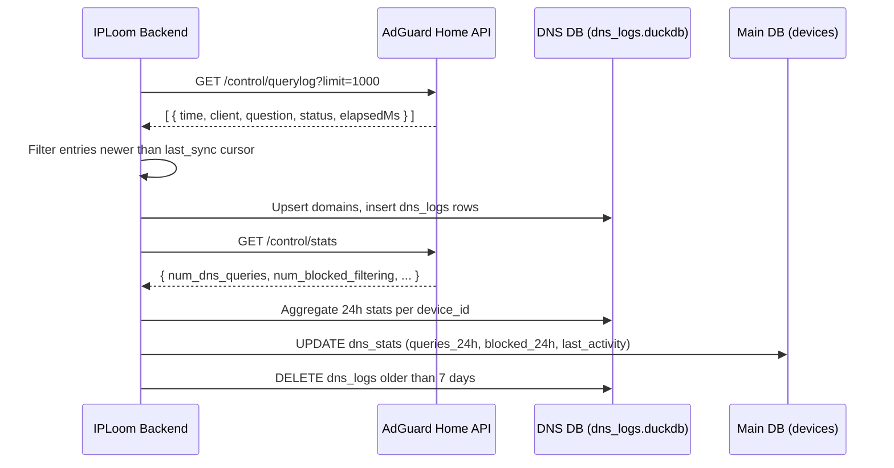

# AdGuard Home Integration Guide

Integrate your AdGuard Home instance with IPLoom to unlock DNS-level analytics, per-device query tracking, and ad/tracker blocking visibility across your entire network.

## How it Works

IPLoom uses a **"Pull" model**, periodically connecting to the AdGuard Home REST API (`/control/querylog`, `/control/stats`) to fetch DNS query logs. By default, it polls every **5 minutes** (configurable).

**Features:**
- **DNS Query Logs**: Stores up to the latest **1,000 queries** per sync cycle into a dedicated DNS database.
- **Block Detection**: Identifies blocked queries from statuses like `FilteredBlackList`, `SafeBrowsing`, and `ParentalControl`.
- **Per-Device Analytics**: Maps DNS client IPs to known IPLoom devices and aggregates **24-hour query and block counts**.
- **DNS Analytics View**: Enables the **Analytics** page in the UI with domain-level, device-level, and category-level breakdowns.
- **7-Day Retention**: DNS logs are automatically pruned to the last 7 days to keep the database lean.
- **Device Card Stats**: Each device card shows live `queries_24h` and `blocked_24h` counters sourced from AdGuard data.

> **Note:** IPLoom maps DNS clients using device **IP address**. Devices must be discovered by the Network Scanner first for their DNS stats to be attributed correctly. Unrecognised client IPs are still logged but appear as anonymous entries.

---

## Prerequisites

- AdGuard Home **v0.107+** running on your network (local LAN access from the IPLoom host is sufficient).
- AdGuard Home web UI accessible over HTTP/HTTPS (e.g. `http://192.168.1.50:3000`).
- An AdGuard Home user account with at least **read access** (the default `admin` account works).
- Query log must be **enabled** in AdGuard Home settings (`Settings → General → Query Log`).

---

## 1. AdGuard Home Setup

No special packages or ACL changes are needed. Ensure the following in the AdGuard Home UI:

### Step 1: Enable Query Log

1. Open AdGuard Home and go to **Settings → General Settings**.
2. Scroll to **Query Log** and make sure it is **enabled**.
3. Set the retention period to at least **7 days** (matches IPLoom's default retention).

### Step 2: Verify API Access

AdGuard Home's REST API is enabled by default. You can confirm it works by opening a browser or running:

```bash
curl -u admin:yourpassword http://192.168.1.50:3000/control/stats
```

A JSON response with `num_dns_queries`, `num_blocked_filtering`, etc. confirms the API is reachable.

---

## 2. IPLoom Configuration

1. Open IPLoom and navigate to **Settings**.
2. Scroll to the **AdGuard Home Integration** section.
3. Fill in your details:

   | Field        | Description                                      | Example                        |
   |--------------|--------------------------------------------------|--------------------------------|
   | **URL**      | Full base URL of your AdGuard Home instance      | `http://192.168.1.50:3000`     |
   | **Username** | AdGuard Home login username                      | `admin`                        |
   | **Password** | AdGuard Home login password                      | `••••••••`                     |
   | **Interval** | Polling frequency in minutes (default: `5`)      | `5`                            |

4. Click **Test** to verify connectivity. The status indicator will turn **green** if successful.
5. Click **Save** to persist the configuration.
6. Optionally, click **Sync Now** to trigger an immediate DNS log pull.

---

## 3. What Gets Synced

Each sync cycle does the following:



### DNS Log Fields Captured

| Field           | Source in AdGuard Response              | Description                      |
|-----------------|-----------------------------------------|----------------------------------|
| `timestamp`     | `item.time`                             | UTC timestamp of the query       |
| `domain`        | `item.question.name`                    | Domain that was queried          |
| `client_ip`     | `item.client`                           | IP address of the querying device|
| `status`        | `item.status`                           | AdGuard resolution status        |
| `query_type`    | `item.question.type`                    | DNS record type (`A`, `AAAA`, `PTR`, etc.) |
| `response_time` | `item.elapsedMs`                        | Query response time in ms        |
| `is_blocked`    | Derived from `status` & `filterId`      | `true` if blocked by a filter    |

### Block Status Detection

A query is marked as **blocked** (`is_blocked = true`) if any of these conditions are met:

- `status` is one of: `FilteredBlackList`, `SafeBrowsing`, `ParentalControl`, `Blocked`
- `status` starts with `Filtered` (and is not `FilteredSafeSearch`)
- `filterId` is present and the status contains `Filtered`

---

## 4. Analytics Page

Once configured, the **Analytics** page becomes active and displays:

- **Top Queried Domains** – Most frequently resolved domains across your network.
- **Top Blocked Domains** – Domains most often blocked by your filter lists.
- **Per-Device DNS Activity** – Query count and block rate per known device.
- **Query Timeline** – DNS query volume over time.

> If AdGuard is not configured, the Analytics page will show a prompt to connect your instance.

---

## 5. API Endpoints (IPLoom Backend)

The integration exposes the following internal REST endpoints (prefixed at `/integrations/adguard`):

| Method | Path       | Description                                              |
|--------|------------|----------------------------------------------------------|
| `GET`  | `/config`  | Retrieve saved AdGuard config (password masked)          |
| `POST` | `/config`  | Save config and immediately verify the connection        |
| `POST` | `/verify`  | Test connectivity without saving                         |
| `POST` | `/sync`    | Trigger an immediate background sync                     |

---

## Technical Deep Dive: Data Processing Logic

IPLoom uses a sophisticated ingestion pipeline to ensure DNS data is accurate and doesn't overload the system.

### 1. High-Water Mark Deduplication
To avoid duplicate entries, the sync engine uses a **Cursor-based polling** strategy:
- Every successful sync stores the `timestamp` of the most recent query in the database.
- The next sync cycle requests entries from AdGuard Home and filters them locally: `if query_time > last_sync_cursor`.
- This ensures that even if sync intervals overlap or AdGuard returns previously seen logs, IPLoom only processes new data.

### 2. IP-to-Device Attribution
AdGuard Home logs queries by **Client IP**. IPLoom maps these to devices using the following priority:
1. **Primary Match**: Looks for a device in the `devices` table with a matching IP.
2. **Status Update**: If found, the device's `last_activity` is updated, and the query is linked to that `device_id`.
3. **Anonymous Logging**: If the IP is unknown (e.g., a guest device not yet scanned), the query is logged under the IP itself but won't show up on a specific device card.

### 3. Block Detection Logic
A query is only counted as "Blocked" if its status indicates a filtering action. We explicitly filter out certain statuses to maintain accuracy:
- **Included as Block**: `FilteredBlackList`, `SafeBrowsing`, `ParentalControl`, `Blocked`.
- **Excluded**: `FilteredSafeSearch`. We exclude SafeSearch because it represents a *redirect* to a safe version of a site (like Google or YouTube) rather than a denied request. Including it would artificially spike your blocking statistics.

### 4. Database Architecture
DNS logs are **tiered** to protect system performance:
- **Main DB**: Stores device metadata and 24h aggregate counters.
- **DNS DB (`dns_logs.duckdb`)**: A dedicated database optimized for high-volume time-series data. This ensures that a massive spike in DNS traffic doesn't cause lag in the primary device management UI.

---

## Troubleshooting

- **Status stays "Not Verified"**: Confirm the URL is reachable from the IPLoom host and the username/password are correct. Try the `curl` command from the IPLoom server.
- **No DNS Stats on Device Cards**: The device's IP must match a device already discovered by the **Network Scanner**. Devices with unknown IPs are logged but not attributed.
- **Analytics Page Empty After Sync**: Check the **Logs** page for `AdGuard Sync` events. A `completed` event shows how many queries were processed. If `0`, your query log may be empty or the `last_sync` cursor is ahead — try clicking **Sync Now**.
- **Only Getting Partial Data**: IPLoom fetches a maximum of **1,000 entries per sync**. On very busy networks, increase the sync frequency (lower the interval) to avoid missing queries between cycles.
- **`FilteredSafeSearch` not counted as blocked**: This is intentional — Safe Search redirects are not blocked requests and are excluded from the block count.
