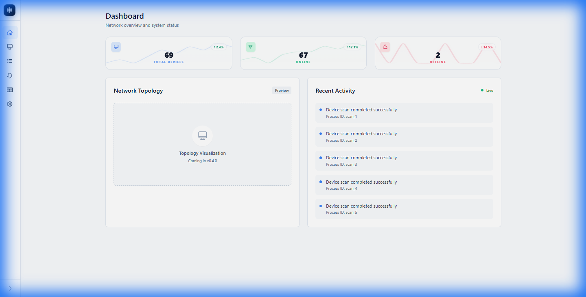
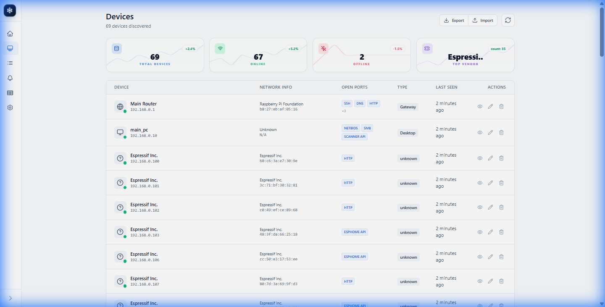
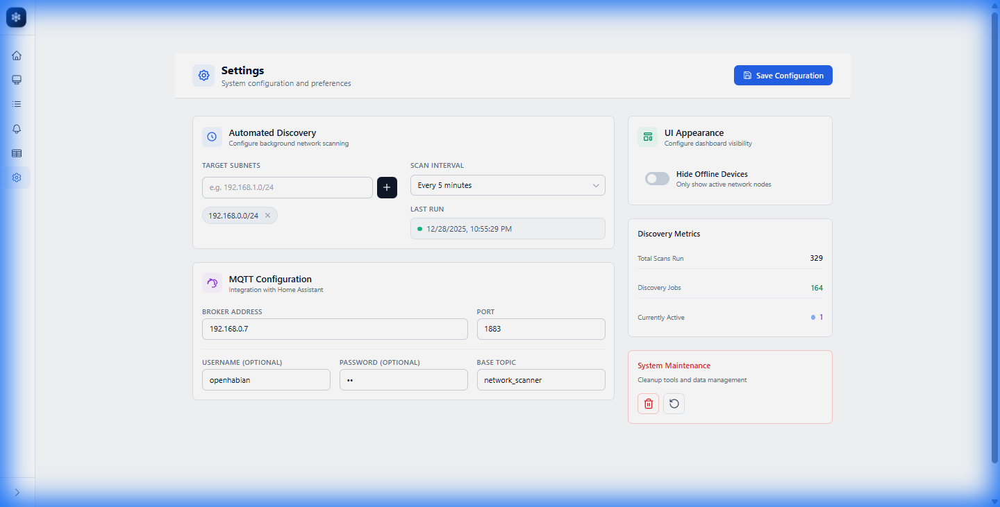
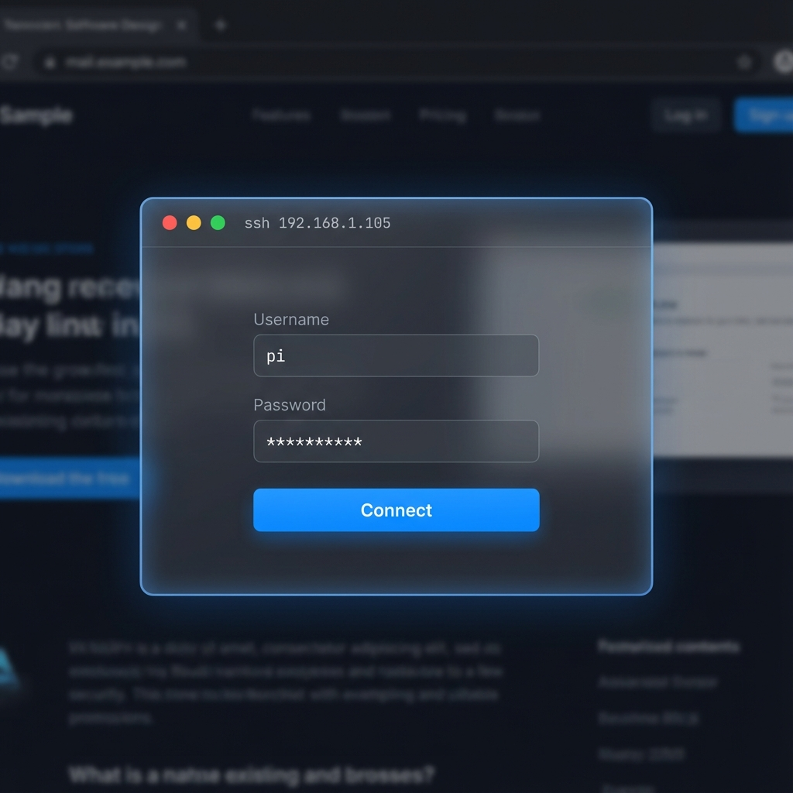
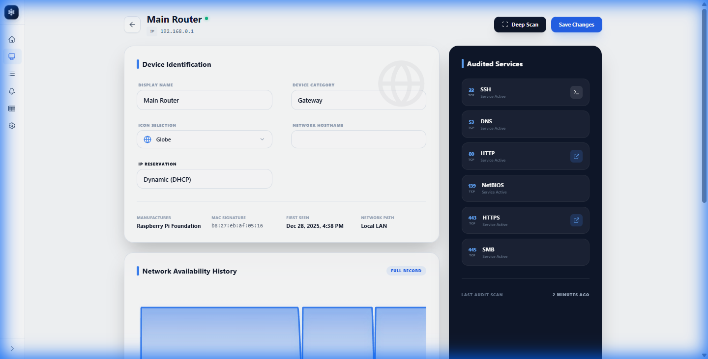
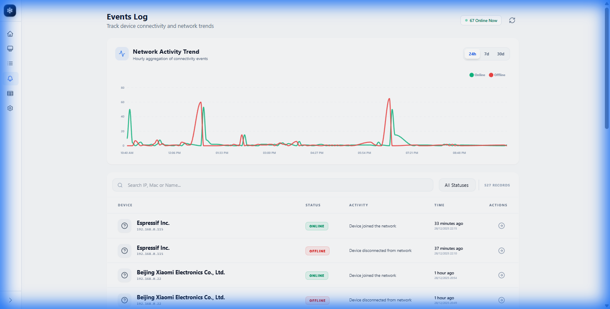
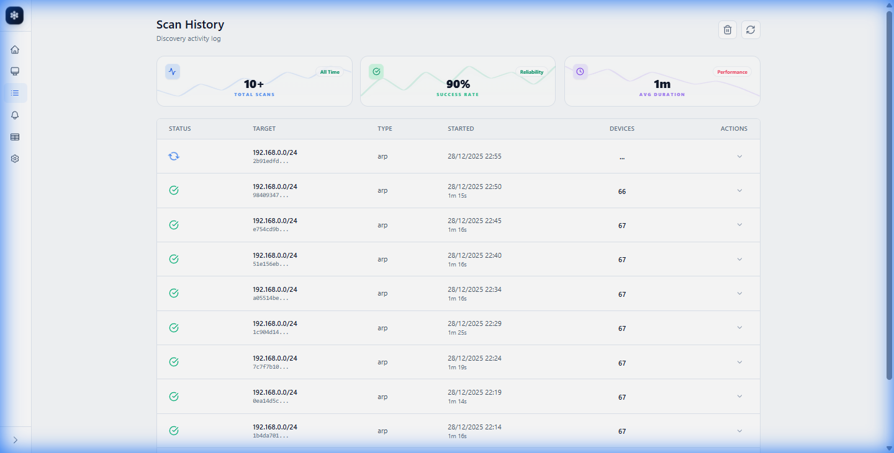
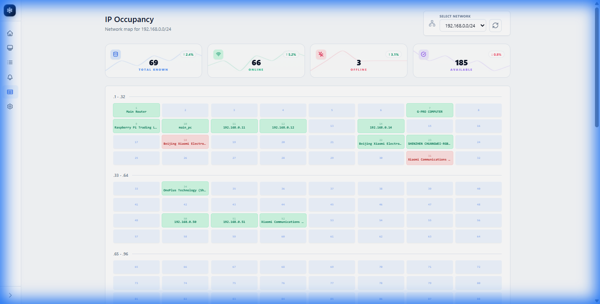
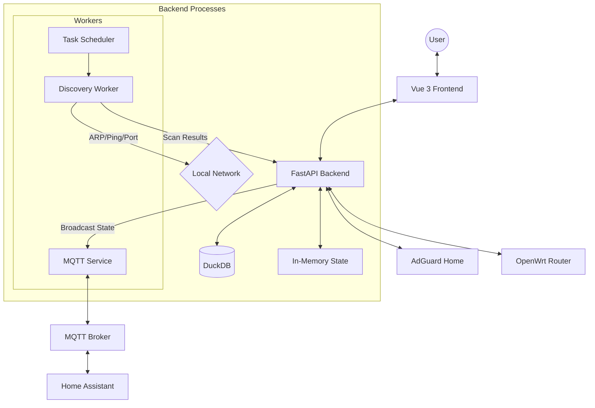

# System Architecture

The Home Network Management System (HNMS) is designed as a modular, high-performance monitoring suite. It leverages a modern asynchronous backend and a reactive frontend to provide real-time visibility into local network environments.

## ✨ Key Features

| Feature | Description |
| :--- | :--- |
| **Dual-Mode Discovery** | Parallel Scapy ARP + ICMP Ping sweeps for 100% device parity across Docker & Windows. |
| **Dynamic Classification** | Fully editable rules engine in the UI for custom icons and device-type matching. |
| **Integrated SSH** | Direct, secure web-based terminal access to your network devices. |
| **Analytical History** | Immutable scan logs and uptime trends with sub-second precision. |
| **Premium UX** | Modern glassmorphism design with unified notification toasts and custom modals. |
| **Rock-Solid Stability** | Shared-connection logic resolves database locking issues in high-concurrency environments. |
| **Timezone Aware** | Optimized timestamp handling with automatic UTC synchronization. |
| **AdGuard Home** | DNS-level analytics and per-device query tracking. |
| **OpenWrt Integration** | Sync DHCP leases, real-time traffic data, and **Immediate Device Blocking** via firewall. |
| **MQTT & Home Assistant** | Publish device presence as binary sensors to your smart home. |

---

## 📸 Gallery

### Device Management

*Granular control over your network inventory with vendor-specific metadata.*

### Intelligent Classification

*Manage how devices are identified with customizable Regex and Port rules.*

### Integrated SSH Terminal

*Direct, secure web-based shell access to your network devices.*

### High-Fidelity Device Details

*Sub-second precision on device availability and deep port audit history.*

### Activity & Scan History

*Visualize spikes in network movement and monitor hardware stability.*

### Scan Logs

*Full historical record of every network discovery cycle.*

### Occupancy Tracking

*Track which devices are home or away over time.*

### Home Assistant Discovery

*HNMS auto-registers devices as binary sensors in Home Assistant via MQTT Discovery.*

---

## Core Design Principles

### 1. IP Scan as the Definitive Source of Truth
The central tenet of IPLoom is that **local network sweeps are the absolute source of truth**. 
- The system does **not** rely on third-party router clients or integrations to know if a device is online. 
- It actively broadcasts ARP requests and conducts parallel ICMP Ping sweeps directly on the local LAN.
- **Integrations (Deco, OpenWrt, AdGuard) only enrich this truth:** They map secondary parameters like signal strength, active mesh node connections, DHCP leases, and DNS logs, but the backend scanner handles primary hardware visibility and availability state.

### 2. Manual Scans vs. Scheduled background Scans
IPLoom supports two scanning triggers:
- **Scheduled Scans (Automatic):** A background worker sweeps the subnet periodically at user-defined intervals (configured in Settings) to maintain history databases.
- **Manual Scans (Instant):** Users can trigger instant sweeps via the UI. High-speed subnet sweeps are streamed in real-time to the screen via `/discovery/scan/stream` without saving to the persistent DB registry to prevent ledger clutter.

### 3. Dynamic Topology & Mesh Satellite Mapping
The **Topology Page** uses a physics-based layout engine to visualize your local network. 
- Satellites and client devices are mapped using parent-child relationships (e.g. `parent_id` matching in the DuckDB ledger).
- When TP-Link Deco or OpenWrt integrations are enabled, the sync engine maps each Wi-Fi client's connection to the specific satellite unit (`deco_node` or BSSID). 
- This maps the hardware nodes into a tree structure (*Gateway -> Satellite APs -> Associated Clients*).

### 4. Custom Brands & Device Icon Resolution
IPLoom utilizes a robust hierarchy to resolve device brands and visual icons:
- **Built-in Rules Engine:** Matches MAC addresses against the IEEE OUI vendor registry and hostnames against pattern regex.
- **Custom Asset Management:** Users can upload custom brand logos and custom device icons directly from the Settings page. Manual overrides in the Device Details screen prioritize user choices over automated rules.

---

## Architecture Overview

The system is split into three main layers:
1.  **Frontend (Presentation Layer)**: A Vue 3 SPA that interacts with the backend via REST APIs.
2.  **Backend (Application Layer)**: A FastAPI service that manages the API, state, and orchestration.
3.  **Workers (Discovery Layer)**: Asynchronous loops that handle low-level network scanning and integration syncing.

### System Flow Diagram

## Tech Stack

### Frontend
- **Framework**: [Vue 3](https://vuejs.org/) (Composition API) for a modern, reactive UI.
- **Build Tool**: [Vite](https://vitejs.dev/) for ultra-fast development and optimized production builds.
- **Styling**: [Tailwind CSS](https://tailwindcss.com/) with a custom Glassmorphism theme.
- **State Management**: Reactive refs and custom stores.
- **Visuals**: [Lucide Vue](https://lucide.dev/) for premium iconography and [Chart.js](https://www.chartjs.org/) for analytics.

### Backend
- **Framework**: [FastAPI](https://fastapi.tiangolo.com/) for high-performance, type-safe Python development.
- **Server**: [Uvicorn](https://www.uvicorn.org/) ASGI server.
- **Scanning Engine**:
    - **Scapy**: Used for raw Layer 2 ARP packet generation and sniffing.
    - **Native Async**: Python `asyncio` for non-blocking port scanning.
- **Integrations**: `paho-mqtt` for smart home communication.

### Data Storage
- **Database**: [DuckDB](https://duckdb.org/)
    - Chosen for its exceptional analytical performance.
    - Enables high-speed historical tracking and complex queries over device uptime and events.
    - Persistent storage via a single file (`network_scanner.duckdb`).

## Communication Patterns

### 1. REST API
Most interactions (fetching devices, updating rules, triggering scans) occur via standard RESTful endpoints.

### 2. Polling & Logging
Real-time task feedback (e.g., scan progress) is implemented via a JSON-based event log. The UI polls the `/api/v1/task-events` endpoint to display live feedback to the user without maintaining complex WebSocket state.

### 3. Background Workers
HNMS maintains persistent background loops:
- **Scheduler Loop**: Manages periodic scans based on user-defined intervals.
- **Scan Runner**: A dedicated queue-based worker that ensures network discovery tasks do not block the main API performance.
- **Integration Sync**: Periodic polling of OpenWrt and AdGuard data.
- **Reactive Actions**: Immediate device blocking commands are sent out-of-band to the OpenWrt router using a **"Triple-Tap" enforcement** (UCI priority rule + DROP target + Conntrack flush).

## Deployment Strategy

The application is containerized using a **monolithic Docker approach**. Both the Nginx-served UI and the FastAPI backend run within the same container environment, managed by `supervisord`. This ensures a single, easy-to-deploy unit that can be run on Raspberry Pi, NAS, or standard Linux servers.

> [!TIP]
> For optimal performance on Linux, use `network_mode: host` to give the Scapy engine full access to the host's network interfaces.
