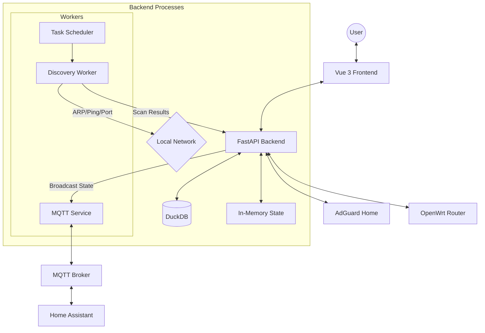

# System Architecture

The Home Network Management System (HNMS) is designed as a modular, high-performance monitoring suite. It leverages a modern asynchronous backend and a reactive frontend to provide real-time visibility into local network environments.

## Architecture Overview

The system is split into three main layers:
1.  **Frontend (Presentation Layer)**: A Vue 3 SPA that interacts with the backend via REST APIs.
2.  **Backend (Application Layer)**: A FastAPI service that manages the API, state, and orchestration.
3.  **Workers (Discovery Layer)**: Asynchronous loops that handle low-level network scanning and integration syncing.

### System Flow Diagram

## Tech Stack

### Frontend
- **Framework**: [Vue 3](https://vuejs.org/) (Composition API) for a modern, reactive UI.
- **Build Tool**: [Vite](https://vitejs.dev/) for ultra-fast development and optimized production builds.
- **Styling**: [Tailwind CSS](https://tailwindcss.com/) with a custom Glassmorphism theme.
- **State Management**: Reactive refs and custom stores.
- **Visuals**: [Lucide Vue](https://lucide.dev/) for premium iconography and [Chart.js](https://www.chartjs.org/) for analytics.

### Backend
- **Framework**: [FastAPI](https://fastapi.tiangolo.com/) for high-performance, type-safe Python development.
- **Server**: [Uvicorn](https://www.uvicorn.org/) ASGI server.
- **Scanning Engine**:
    - **Scapy**: Used for raw Layer 2 ARP packet generation and sniffing.
    - **Native Async**: Python `asyncio` for non-blocking port scanning.
- **Integrations**: `paho-mqtt` for smart home communication.

### Data Storage
- **Database**: [DuckDB](https://duckdb.org/)
    - Chosen for its exceptional analytical performance.
    - Enables high-speed historical tracking and complex queries over device uptime and events.
    - Persistent storage via a single file (`network_scanner.duckdb`).

## Communication Patterns

### 1. REST API
Most interactions (fetching devices, updating rules, triggering scans) occur via standard RESTful endpoints.

### 2. Polling & Logging
Real-time task feedback (e.g., scan progress) is implemented via a JSON-based event log. The UI polls the `/api/v1/task-events` endpoint to display live feedback to the user without maintaining complex WebSocket state.

### 3. Background Workers
HNMS maintains persistent background loops:
- **Scheduler Loop**: Manages periodic scans based on user-defined intervals.
- **Scan Runner**: A dedicated queue-based worker that ensures network discovery tasks do not block the main API performance.
- **Integration Sync**: Periodic polling of OpenWrt and AdGuard data.

## Deployment Strategy

The application is containerized using a **monolithic Docker approach**. Both the Nginx-served UI and the FastAPI backend run within the same container environment, managed by `supervisord`. This ensures a single, easy-to-deploy unit that can be run on Raspberry Pi, NAS, or standard Linux servers.

> [!TIP]
> For optimal performance on Linux, use `network_mode: host` to give the Scapy engine full access to the host's network interfaces.
