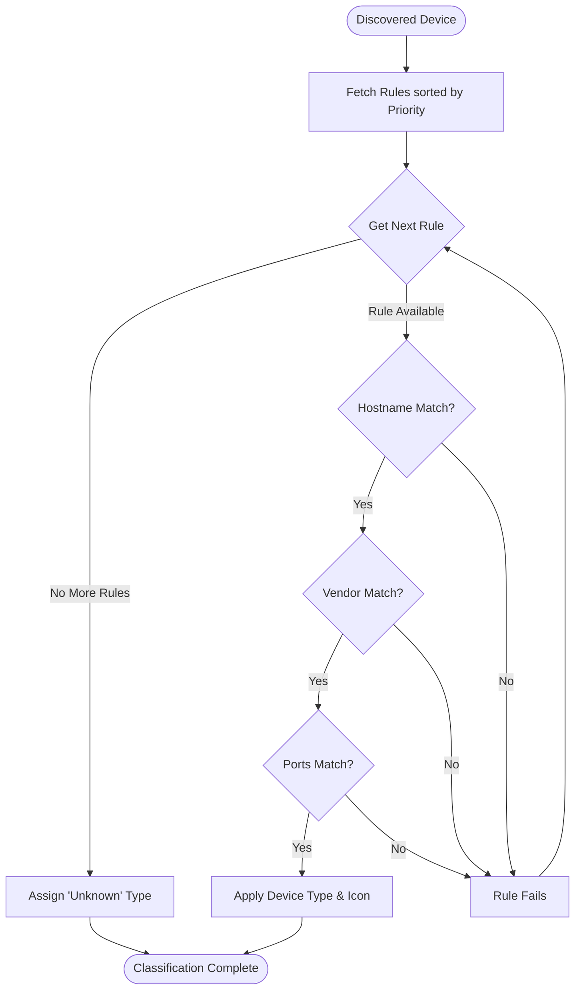

# Device Classification Rules

HNMS features a powerful, dynamic classification engine that allows you to transform raw network data (MACs and IPs) into a meaningful inventory with custom icons and labels.

## Rule Matching Logic

The engine processes every discovered device against a list of prioritized rules. The first rule that matches "wins," so you can define specific rules for individual devices and broader rules for generic types.

### Rule Matching Flow

## How Rules are Structured

A classification rule consists of several optional patterns. A rule matches only if **all** provided patterns match (AND logic):

| Field | Description | Example |
| :--- | :--- | :--- |
| **Hostname Pattern** | A Regex string to match the device's rDNS name. | `^esphome-.*` |
| **Vendor Pattern** | A Regex string to match the MAC vendor (OUI). | `.*Espressif.*` |
| **Ports** | A list of TCP ports. Matches if **any** of these ports are open on the device. | `[8123, 1883]` |

## Priority & Built-in Rules

- **Priority**: Lower numbers represent higher priority (e.g., a rule with priority `10` is checked before priority `100`).
- **Built-in Rules**: HNMS comes with a set of "Built-in" rules (priority `1000+`) to identify common devices like Home Assistant, ESPHome, and standard routers. These can be overridden by creating custom rules with higher priority (lower numbers).

## Creating a Custom Rule

To create a rule in the UI:
1.  Navigate to **Settings > Classification Rules**.
2.  Click **Add Rule**.
3.  **Name**: Give it a friendly name (e.g., "Smart Plugs").
4.  **Identify by Hostname**: Use a regex if your devices follow a naming convention (e.g., `tasmota-.*`).
5.  **Identify by Ports**: If your devices run specific services, add those ports (e.g., `80`).
6.  **Select Icon**: Choose a premium Lucide icon that represents the device.
7.  **Device Type**: Select a category (e.g., `IoT`, `Infrastructure`).

## Technical Implementation

The classification logic resides in `app/services/classification.py`. It uses Python's `re` module for regex matching and set intersection for port matching. 

When a rule matches, the following device attributes are updated:
- `device_type`
- `icon`
- `display_name` (If the rule defines one)

> [!NOTE]
> Classification is triggered automatically after every network scan and whenever rules are modified in the Settings.
