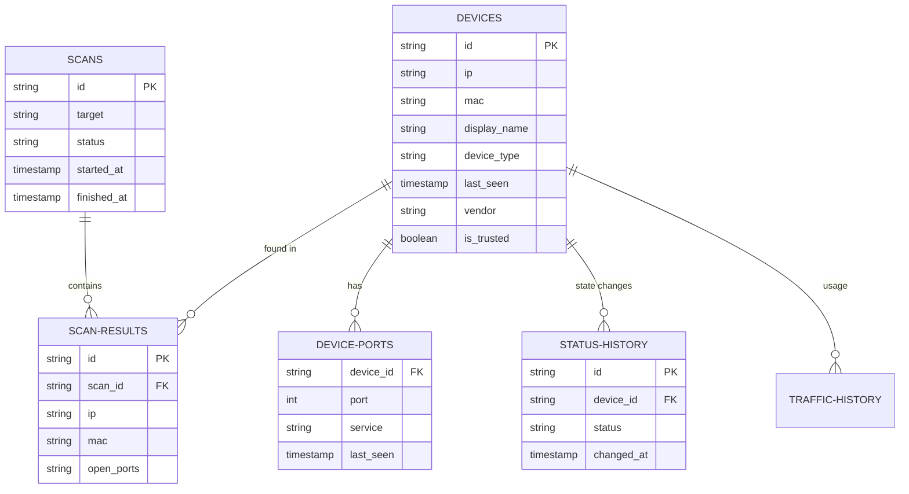

# Database Schema

HNMS utilizes **DuckDB** for its primary data storage. DuckDB was chosen for its high-performance columnar storage, making it ideal for analytical queries over historical network data while remaining lightweight enough to run on embedded systems.

## Entity Relationship Diagram



## Key Tables

### `devices`
The core inventory of your network. Every unique MAC address discovered is stored here. If a device changes its IP, the `ip` field is updated, but the historical `mac` link remains.

### `scans` & `scan_results`
Tracks every network scan performed by the system.
- `scans` stores the metadata (duration, success/failure).
- `scan_results` is a snapshot of exactly what was found at that specific moment in time.

### `device_status_history`
Enables the "Uptime" and "Presence" analytics. Every time a device flips between `online` and `offline`, a new row is added here. This allows the UI to calculate availability percentages over any time range.

### `device_traffic_history`
Stores data consumption metrics gathered from integrations like **OpenWrt**.
- `rx_bytes` / `tx_bytes`: Cumulative data transferred.
- `down_rate` / `up_rate`: Current speed at the time of sync.

## Performance Optimization

HNMS uses specialized indexes to ensure that historical queries remain fast even after months of data collection:
- `idx_history_device_id`: Fast lookup for specific device uptime.
- `idx_traffic_timestamp`: Optimized for rendering traffic charts over time.
- `idx_scan_results_mac`: Correlation between devices and their scan history.

## Manual Database Access

Since DuckDB is a file-based database, you can inspect it manually using the DuckDB CLI:

```bash
# Inside the container or data directory
duckdb network_scanner.duckdb

# Example Query: Top 5 devices by open port count
SELECT display_name, json_array_length(open_ports) as ports 
FROM devices 
ORDER BY ports DESC 
LIMIT 5;
```

> [!CAUTION]
> Avoid modifying the database while the HNMS service is running to prevent database locking issues.
