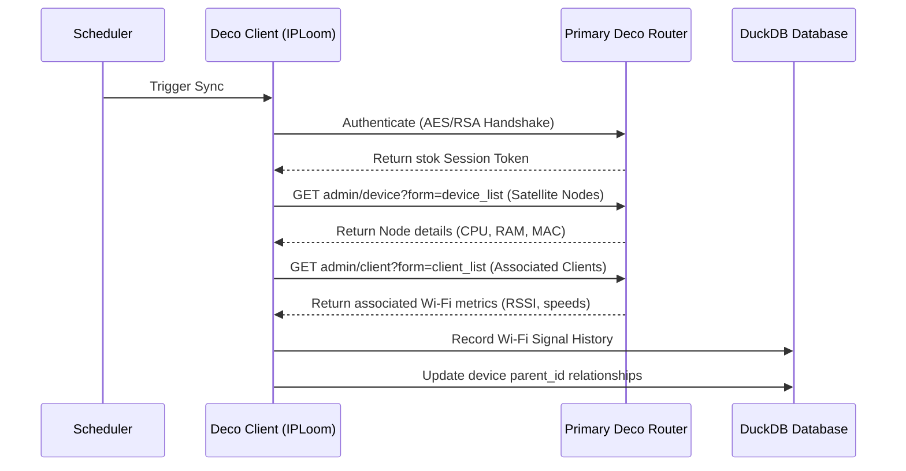

# TP-Link Deco Mesh Integration

Integrate your TP-Link Deco Mesh network with IPLoom to unlock real-time Wi-Fi client tracking, mesh satellite nodes mapping, signal strength history, and physical topology trees.

---

## The Core Concept: Enrichment vs. Source of Truth

> [!IMPORTANT]
> **The IP/Subnet Scanner is the absolute Source of Truth.**
> Integrations like TP-Link Deco, OpenWrt, or AdGuard Home do **NOT** act as the primary engine for discovering hosts. The system requires active local network sweeps (ARP broadcast / Parallel Ping) to populate device status, resolve hardware MAC addresses, and log IP mappings.
> 
> Once a device is verified by the scanner, integrations are queried to **enrich** the device with parameters like:
> - Which mesh satellite node the device is connected to (`deco_node`)
> - The current Wi-Fi frequency band (`2.4GHz` or `5GHz`)
> - Signal strength (`wlan_rssi` in dBm)
> - Current upload/download bandwidth usage

---

## How it Works

IPLoom includes a built-in reverse-engineered client for TP-Link Deco Mesh routers written in pure Python. It communicates with the local router's administrative CGI endpoints without relying on external cloud APIs or proprietary libraries.

- **Encrypted Login Handshake:** Supports newer firmware authentication protocols using dynamic AES key/IV generation and RSA password encryption.
- **Legacy MD5 Login:** Includes an automatic fallback to legacy MD5-based logins for older firmware models.
- **Topology Tree Structure:** Queries both the primary node and satellites to map physical parent-child connections.

---

## 1. Prerequisites

- A local TP-Link Deco Mesh network (e.g. Deco M4, M5, X20, X60, etc.).
- Administrative password for your Deco network (set during initial setup via the Deco mobile app).
- Network routing that allows the IPLoom host to reach the primary Deco node IP address (usually the default gateway `192.168.68.1` or `192.168.0.1`).

---

## 2. Configuration in IPLoom

1. Navigate to the **Integrations** page in the IPLoom web dashboard.
2. Find the **TP-Link Deco** card and click **Configure**.
3. Fill in the connection settings:
   - **Host:** IP address of your primary Deco router (e.g., `192.168.0.1`).
   - **Password:** Router admin interface password.
4. Click **Test Connection** to verify settings.
5. Save the configuration.

Once saved, a background scheduler runs a synchronization job at regular intervals (default: every 60 seconds).

---

## 3. Data Sync Flow

---

## 4. Attributes Captured & Logged

During each sync, IPLoom updates the following fields in the database for each associated client:

| Parameter | Type | Description |
| :--- | :--- | :--- |
| `deco_node` | `TEXT` | Name of the specific Deco satellite node the device is connected to. |
| `connection_type` | `TEXT` | Attributed connection interface (`wireless` or `wired`). |
| `wlan_band` | `TEXT` | Active band interface (`2.4GHz` or `5GHz`). |
| `wlan_rssi` | `INTEGER` | Wi-Fi signal strength in dBm or signal level (0-5). |
| `up_speed` / `down_speed` | `BIGINT` | Real-time byte-rate indicators. |

### Signal Strength Timeline
Every RSSI value fetched is logged to the `wifi_signal_history` table:
- **Table:** `wifi_signal_history`
- **Fields:** `id`, `device_id`, `rssi`, `band`, `mesh_node`, `source` (`'deco'`), `timestamp`

---

## 5. Troubleshooting

- **Deco Connection Refused:** Make sure the IP address corresponds to your *primary* Deco unit. Satellite units do not run the administrative CGI API.
- **Login Failures:** Try logging into the Deco router's local web panel via your browser (`http://<deco-ip>`) to verify your admin password.
- **Topology nodes aren't updating:** The background sync maps MAC addresses to associate parent nodes. Make sure the network scanner has run at least once to discover the nodes' hardware interfaces.
