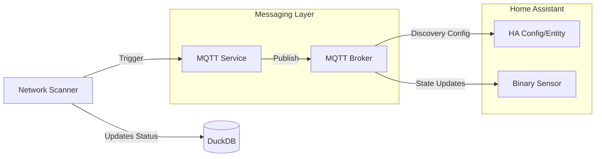

# MQTT & Home Assistant Integration

HNMS acts as a bridge between your network hardware and your smart home automation platform. By enabling MQTT, you can track network presence in real-time and trigger automations based on device availability.

## Data Pipeline

The integration follows an automated pipeline from discovery to your dashboard:

## Configuration

To enable MQTT:
1.  Go to **Settings > MQTT Configuration**.
2.  Set **Enabled** to `true`.
3.  Provide your **Broker Host** (e.g., `192.168.1.50`) and credentials.
4.  Define a **Base Topic** (default: `hnms`).

## Topic Structure

HNMS publishes data using the following patterns:

| Topic | Description | Payload Example |
| :--- | :--- | :--- |
| `{base}/device/{mac}/state` | Presence status. | `home` or `not_home` |
| `{base}/device/{mac}/attributes` | Rich metadata JSON. | `{"ip": "1.1.1.1", "vendor": "Apple"}` |
| `{base}/status` | HNMS service health. | `online` |

## Home Assistant MQTT Discovery

When "Home Assistant Discovery" is enabled in settings, HNMS automatically registers every discovered device as a **Binary Sensor** in Home Assistant.

### How it Works
1.  HNMS publishes a configuration payload to:
    `homeassistant/binary_sensor/hnms_{mac_clean}/config`
2.  Home Assistant sees this and creates a new entity (e.g., `binary_sensor.iphone_15_pro`).
3.  The device appears as "On" when connected (`home`) and "Off" when disconnected (`not_home`).

### Entity Metadata
Devices registered via discovery include:
- **Device Class**: `connectivity`
- **Icon**: Automatically mapped from HNMS classification (e.g., `mdi:router` for infrastructure).
- **Manufacturer**: The MAC vendor (e.g., `Samsung Electronics`).
- **Model**: The classified device type.

## Technical Details

The MQTT service (`app/services/mqtt.py`) maintains a persistent connection using the `paho-mqtt` library. It uses a **Last Will and Testament (LWT)** to ensure that if the HNMS container crashes, Home Assistant is immediately notified that the service is `offline`.

> [!TIP]
> Use a tool like **MQTT Explorer** to monitor the `{base}/#` topics and verify that your devices are broadcasting correctly before configuring Home Assistant automations.
