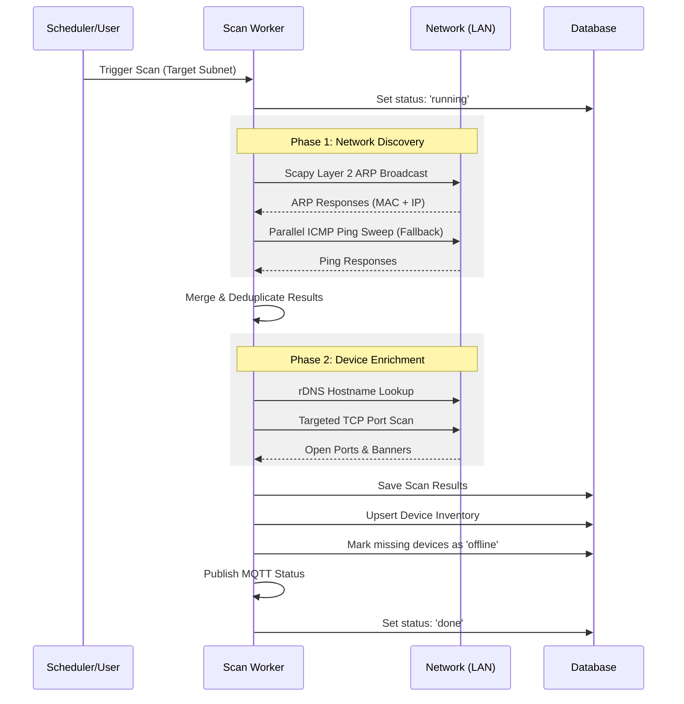

# Scanning Engine

The Scanning Engine is the heart of IPLoom. It is designed to be resilient, fast, and capable of operating across different network environments (Linux vs. Windows, Docker vs. Bare Metal).

## Discovery Logic

IPLoom uses a multi-layered approach to ensure 100% device parity. It prioritizes low-level hardware discovery but includes high-level network fallbacks.

### Discovery Sequence

## Discovery Methods

### 1. Scapy ARP Discovery (Preferred)
Scapy generates raw Ethernet frames with ARP requests addressed to the broadcast MAC (`ff:ff:ff:ff:ff:ff`).
- **Pros**: Extremely fast; bypasses OS-level IP restrictions; reliably captures MAC addresses.
- **Cons**: Requires `root` or `Administrator` privileges; requires `network_mode: host` in Docker.

### 2. Parallel Ping Sweep (Fallback)
If Layer 2 access is restricted (common on Windows without Npcap or in bridge-mode Docker), IPLoom pivots to a Layer 3 ICMP ping sweep.
- **Logic**: Uses `asyncio.Semaphore` to ping hundreds of IPs simultaneously.
- **MAC Resolution**: After a successful ping, IPLoom attempts to resolve the MAC address by querying the system's local ARP cache (`arp -a`).

## Enrichment Phase

Once a device is found, IPLoom performs "Enrichment" to gather more metadata:

### Port Scanning
Instead of scanning all 65,535 ports, IPLoom uses a **Targeted Port Strategy**:
1.  **Rule-Based Ports**: It extracts all ports defined in your **Classification Rules**.
2.  **Basics**: It always checks common infrastructure ports (80, 443, 22, 1883, 8123, etc.).
3.  **Deep Audit**: If a manual "Deep Audit" is triggered, it scans the top 1000 common ports.

### Hostname Resolution
Performs reverse DNS lookups to identify local network names (e.g., `raspberrypi.local`).

## Worker Architecture

The scanning logic runs in a dedicated `scan_runner_loop`:
- **Concurrency Control**: A semaphore limits the number of simultaneous device enrichments to prevent network congestion or CPU spikes on low-power devices like Raspberry Pi.
- **Stale Scan Cleanup**: On startup, the system automatically marks any `running` or `queued` scans from a previous session as `interrupted`.

## Troubleshooting Windows Discovery

If discovery is not finding all devices on Windows:
1.  **Install Npcap**: Required for Scapy to send raw packets. Ensure "WinPcap API-compatible mode" is selected during install.
2.  **Run as Admin**: The terminal running the backend must have administrative privileges.
3.  **Ping Fallback**: If ARP fails, the system will use Ping. Ensure your devices respond to ICMP (some Windows firewalls block this by default).
