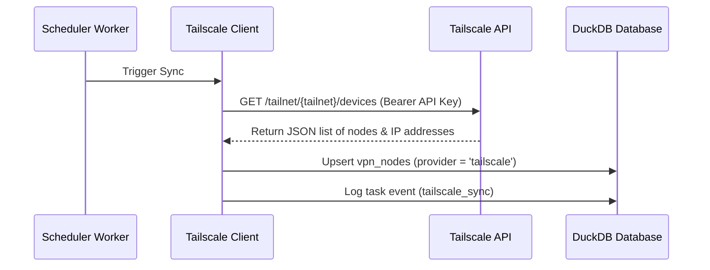

# Tailscale Integration

Integrate IPLoom with your Tailscale overlay network (tailnet) to track and monitor VPN nodes in real-time. This integration synchronizes your Tailscale devices, capturing metadata such as OS version, client version, last seen timestamps, and connection status, allowing administrators to audit remote access points alongside physical local devices.

---

## 💡 How It Works

Unlike local physical network scanning (e.g. Scapy-based Layer 2 ARP discovery), remote VPN nodes cannot be discovered via broadcasts. The Tailscale integration polls the official Tailscale API to retrieve and sync nodes configured within your tailnet.

- **Background Synchronization**: A scheduled background worker checks the database at user-defined intervals (default: 15 minutes) and updates the status of Tailscale devices.
- **Manual Synchronization**: Users can trigger an immediate manual synchronization from the Tailscale tab in the Integrations dashboard.
- **VPN Node Tracking**: Devices synchronized from Tailscale are logged in the `vpn_nodes` table under the `tailscale` provider, separate from physical local devices, avoiding IP mapping pollution.

---

## 1. Prerequisites

- A Tailscale account and configured tailnet.
- A **Tailscale API access token** (API key) generated from the [Tailscale Admin Console](https://login.tailscale.com/admin/settings/keys).
- The name of your tailnet (defaults to `-`, which uses the default tailnet associated with the API key).

---

## 2. Configuration in IPLoom

1. Navigate to the **Integrations** page in the IPLoom dashboard (web UI or mobile app).
2. Locate the **Tailscale** integration panel.
3. Fill in the connection settings:
   - **API Key**: The Tailscale API access token (`tskey-api-...`).
   - **Tailnet**: The tailnet identifier (e.g., `my-tailnet.github` or `-` for default).
   - **Sync Interval**: Interval in minutes for background checks (default: `15`).
   - **Enabled**: Toggle switch to enable or disable background synchronization.
4. Click **Test Connection / Verify** to validate the credentials against the Tailscale API.
5. Click **Save Config** to persist configuration.

---

## 3. Data Sync Flow

---

## 4. Attributes Captured & Logged

Synced Tailscale nodes are stored in the database with the following attributes:

| Attribute | Type | Description |
| :--- | :--- | :--- |
| `id` | `UUID` | Unique identifier generated by IPLoom. |
| `node_id` | `TEXT` | Tailscale internal Node ID. |
| `ip` | `TEXT` | Primary IPv4 address assigned to the Tailscale node. |
| `hostname` | `TEXT` | Tailscale machine hostname. |
| `os` | `TEXT` | Device operating system (e.g., linux, windows, macOS, android). |
| `client_version` | `TEXT` | Tailscale client version installed on the device. |
| `last_seen` | `TIMESTAMP` | ISO 8601 UTC timestamp of last activity reported by Tailscale. |
| `status` | `TEXT` | Connection status (`online` or `offline`). |
| `is_trusted` | `BOOLEAN` | User-definable trust flag for security auditing (default: `FALSE`). |

---

## 5. Security & Node Auditing

Within the **Tailscale tab** of the Integrations view:
- **Trust Node**: Toggle a VPN node's `is_trusted` flag. This helps distinguish authorized administrative clients from unknown or compromised remote devices.
- **Delete Node**: Remove a Tailscale node from the inventory. Note that if the node is still active in your tailnet, the next sync cycle will rediscover it.
